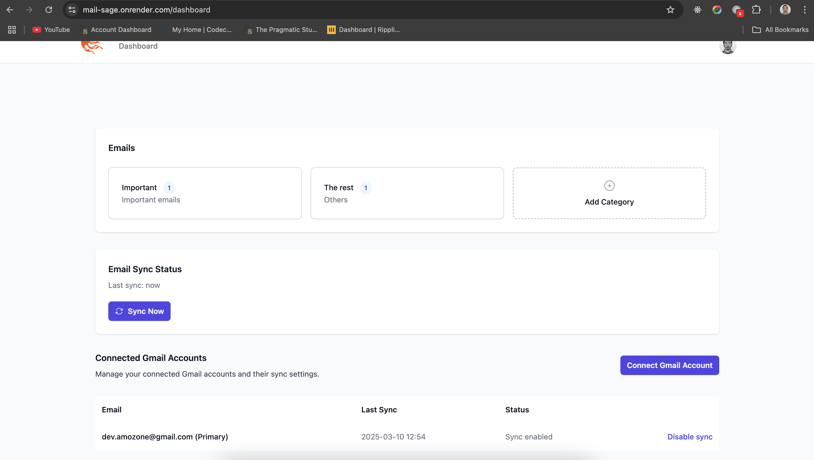

# MailSage

MailSage is an AI-powered email management system that helps you organize and manage your Gmail inbox efficiently. The application uses AI to automatically categorize and summarize emails, making it easier to process and manage large volumes of email.





## Features

### Implemented Features

- **Google OAuth Integration**

  - Sign in with Google functionality
  - Support for multiple Gmail accounts per user

- **Email Categories**

  - Custom category creation with descriptions
  - AI-powered automatic email categorization
  - Category-based email organization

- **Email Processing**

  - Automatic email import from Gmail
  - AI-powered email summarization
  - Email archiving in Gmail
  - Bulk email actions (archive, categorize)

- **Real-time Updates**
  - Live updates using Phoenix LiveView
  - Background email synchronization
  - Scheduled email checks (every minute)

### Pending Features

- **Unsubscribe Automation**

  - Automated unsubscribe link detection
  - AI-powered form filling for unsubscribe processes
  - Bulk unsubscribe actions
  - Status: Implementation started but not completed (see `UnsubscribeWorker` and `Unsubscribe.Agent`)

- **Email Processing Improvements**
  - Enhanced error handling for email sync
  - Optimized batch processing
  - Status: Basic implementation complete, needs optimization

### Technical Stack

- **Backend**

  - Elixir/Phoenix
  - PostgreSQL
  - Phoenix LiveView
  - OpenAI for AI integration
  - Google Gmail API

- **Frontend**
  - Phoenix LiveView
  - Tailwind CSS
  - esbuild

## Development Setup

To start your Phoenix server:

- Run `mix setup` to install and setup dependencies
- Start Phoenix endpoint with `mix phx.server` or inside IEx with `iex -S mix phx.server`

Now you can visit [`localhost:4000`](http://localhost:4000) from your browser.

## Environment Variables Required

- `OPENAI_API_KEY` - OpenAI API key for AI features
- `OPENAI_ORGANIZATION_KEY` - OpenAI organization key
- `GOOGLE_CLIENT_ID` - Google OAuth client ID
- `GOOGLE_CLIENT_SECRET` - Google OAuth client secret
- `GOOGLE_REDIRECT_URI` - OAuth redirect URI

## Testing

The project includes a test suite with some pending tests marked with `@tag :skip`. These tests primarily cover:

- Email synchronization
- Category management
- Unsubscribe functionality
- User interface interactions

To run tests:

```bash
mix test
```

## Known Issues and TODOs

1. Unsubscribe functionality is partially implemented but needs completion
2. Some LiveView tests are pending implementation
3. Email sync process needs optimization for large inboxes
4. Token refresh mechanism needs additional error handling
5. Scheduler implementation needs improvement for user identification

## Security Notes

- The application requires Gmail API scopes for email access
- For development, the app needs to be registered as a Google Cloud Project
- Test users need to be added to the Google Cloud Project during development
